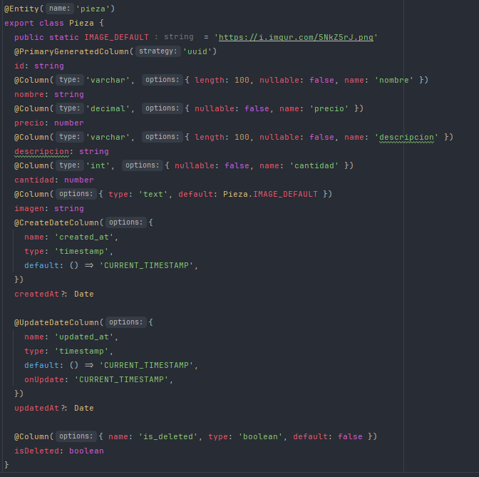
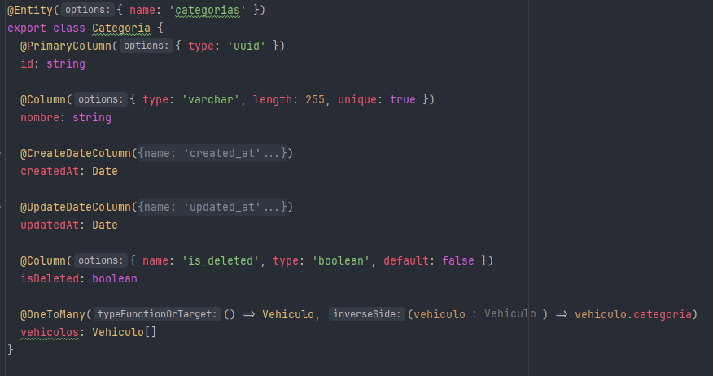
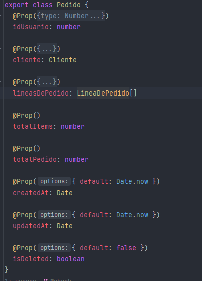
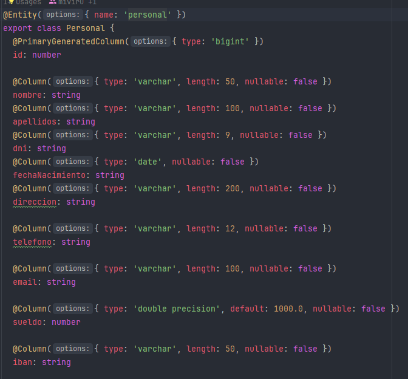
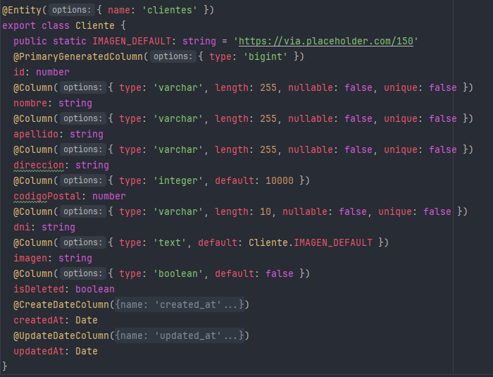
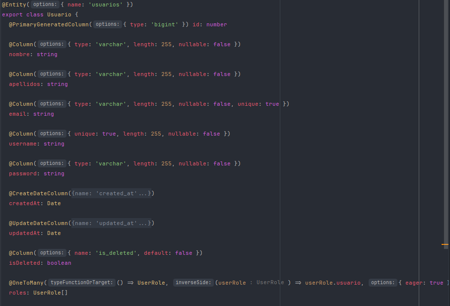

# Proyecto API REST Concesionario de Vehículos


¡Bienvenido al proyecto de API REST para un concesionario de vehículos desarrollado por el equipo **ApiMadMotorDAW**!

## Autores
Este proyecto fue desarrollado por [Mohamed El Kasmi](https://github.com/Mohaek10), [Ruben Fernandez](https://github.com/rubenprzz), [Joe Brandon](https://github.com/JBrandonCL), [Luis Ramos](https://github.com/LuisRamosRobles) y [Miguel Vicario](https://github.com/miviru).
Alumnos de 2º DAW del IES Luis Vives, Proyecto de la asignatura **Desarrollo Web en entornos Servidor**


## Descripción 
Este proyecto consiste en una API REST desarrollada con NestJS para un concesionario de automóviles. La API proporciona funcionalidades para gestionar vehículos, piezas, categorías, pedidos, personal, clientes, autenticación de usuarios y almacenamiento.

## Estructura del Proyecto

El proyecto sigue la siguiente estructura de carpetas:


#### Carpetas Principales

- **config**: Contiene la configuración relacionada con CORS, la base de datos y Swagger.
- **notification**: Gestiona las notificaciones de la aplicación.
- **rest**: Contiene los módulos principales de la API.
  - **auth**: Funcionalidades de autenticación, como DTOs, guards, mappers y estrategias de autenticación.
  - **categorias**: Módulo para gestionar las categorías de vehículos y piezas.
  - **clientes**: Gestiona la información de los clientes, incluyendo DTOs, entidades, guards y mappers.
  - **pedidos**: Maneja los pedidos realizados por los clientes, incluyendo DTOs, guards, mappers, pipes y schemas.
  - **personal**: Módulo para el personal del concesionario, incluyendo DTOs, entidades y mappers.
  - **pieza**: Gestiona las piezas disponibles en el concesionario, incluyendo DTOs, entidades y mappers.
  - **storage**: Contiene funcionalidades relacionadas con el almacenamiento de archivos.
  - **users**: Gestiona los usuarios de la aplicación, incluyendo DTOs, entidades, guards y mappers.
  - **vehiculos**: Módulo para gestionar la información de los vehículos disponibles en el concesionario, incluyendo DTOs, entidades y mappers.

## Bases de datos utilizadas

- **PostgreSQL**: Utilizado para almacenar datos estructurados y relacionales relacionados con la aplicación.
- **MongoDB**: Utilizado para almacenar datos no estructurados o semi-estructurados, especialmente aquellos que pueden crecer o cambiar con el tiempo, como las imágenes de los vehículos.

## Test
En cada carpeta se encuentra el test, además de que en la carpeta test estan los ***Supertests***

## Dependencias utilizadas en el modo de producción


- **@nestjs/cache-manager**: 2.2.0
- **@nestjs/common**: 10.0.0
- **@nestjs/config**: 3.1.1
- **@nestjs/core**: 10.0.0
- **@nestjs/jwt**: 10.2.0
- **@nestjs/mapped-types**: *
- **@nestjs/mongoose**: 10.0.2
- **@nestjs/passport**: 10.0.3
- **@nestjs/platform-express**: 10.0.0
- **@nestjs/platform-socket.io**: 10.3.1
- **@nestjs/swagger**: 7.3.0
- **@nestjs/typeorm**: 10.0.1
- **@nestjs/websockets**: 10.3.1
- **@types/multer**: 1.4.11
- **bcryptjs**: 2.4.3
- **cache-manager**: 5.4.0
- **class-transformer**: 0.5.1
- **class-validator**: 0.14.1
- **cross-env**: 7.0.3
- **dotenv**: 16.4.1
- **mongoose**: 8.1.1
- **mongoose-paginate-v2**: 1.8.0
- **nestjs-paginate**: 8.6.0
- **passport**: 0.7.0
- **passport-jwt**: 4.0.1
- **pg**: 8.11.3
- **reflect-metadata**: 0.1.13
- **rxjs**: 7.8.1
- **typeorm**: 0.3.19


## Modelos de los Endpoints

A continuación, se muestran capturas del modelo de cada endpoint de la API:

### Vehículos


### Piezas


### Categorías


### Pedidos


### Personal


### Clientes



### Usuarios


# Documentación de la API

Bienvenido a la documentación de la API de MadMotorWeb. A continuación, se detallan los principales endpoints disponibles:


## Vehículos

- **Crear nuevo vehículo**
  - Método: POST
  - URL: `https://localhost:3000/v1/vehiculos`
  - Body:
    ```json
    {
    "marca":"Lamborgini",
    "modelo":"Alfa 1",
    "year":2021,
    "km":40000,
    "precio": 999999,
    "stock":678,
    "descripcion":"Bonito pero caro",
    "categoria":"BERLINA"
}
    ```

- **Obtener todos los vehículos**
  - Método: GET
  - URL: `https://localhost:3000/v1/vehiculos`


## Piezas

- **Obtener todas las piezas**
  - Método: GET
  - URL: `https://localhost:3000/v1/pieza`

- **Crear nueva pieza**
  - Método: POST
  - URL: `https://localhost:3000/v1/pieza`
  - Body:
    ```json
    {
    "nombre": "Filtro de aceite",
    "descripcion": "Filtro de aceite para motor de gasolina 1.6L",
    "imagen": "https://example.com/imagenes/filtro-aceite.jpg",
    "precio": 15.99,
    "cantidad": 10,
    "isDeleted": false
}
    ```
## EndPoint de vehiculo: Detalles

| Endpoint                                  | URL                    | HTTP Verbo | AUTH           | Descripción                                        | HTTP Status Code | Otras Salidas            |
|-------------------------------------------|------------------------|------------|----------------|----------------------------------------------------|------------------|--------------------------|
| Obtiene todos los vehículos paginados     | GET /vehiculos         | GET        | No requiere    | Obtiene todos los vehículos paginados.            | 200 OK           |                          |
| Obtiene un vehículo por su ID             | GET /vehiculos/:id     | GET        | No requiere    | Obtiene un vehículo por su ID.                    | 200 OK           | 400 Bad Request          |
| Crea un nuevo vehículo                    | POST /vehiculos        | POST       | JWT, ADMIN     | Crea un nuevo vehículo.                            | 201 Created      | 400 Bad Request, 401 Unauthorized, 403 Forbidden |
| Actualiza un vehículo por su ID           | PATCH /vehiculos/:id   | PATCH      | JWT, ADMIN     | Actualiza un vehículo por su ID.                  | 201 Created      | 400 Bad Request, 401 Unauthorized, 403 Forbidden |
| Elimina un vehículo por su ID             | DELETE /vehiculos/:id  | DELETE     | JWT, ADMIN     | Elimina un vehículo por su ID.                    | 204 No Content   | 400 Bad Request, 401 Unauthorized, 403 Forbidden |
| Actualiza la imagen de un vehículo por su ID | PATCH /vehiculos/imagen/:id | PATCH  | JWT, ADMIN     | Actualiza la imagen de un vehículo por su ID.     | 200 OK           | 400 Bad Request, 401 Unauthorized, 404 Not Found |


## Documentación
Iniciando la api en modo desarrollo se puede acceder a la documentación swagger mediante esta url:  `https://localhost:3000/api`

### Contribución

Las contribuciones son bienvenidas. Si deseas contribuir al proyecto, por favor sigue estas instrucciones:

1. Haz un fork del repositorio.
2. Crea una rama nueva (`git checkout -b feature/nueva-funcionalidad`).
3. Haz tus cambios y commitéalos (`git commit -am 'Añadir nueva funcionalidad'`).
4. Sube tus cambios a la rama (`git push origin feature/nueva-funcionalidad`).
5. Abre una pull request.

## Contacto
mohamed.elkasmi@alumno.iesluisvives.org
miguel.vicario@alumno.iesluisvives.org
luis.ramos@alumno.iesluisvives.org
ruben.fernandez@alumno.iesluisvives.org
miguel.vicario@alumno.iesluisvives.org
joe.brandon@alumno.iesluisvives.org
## Agracedimientos
¡Gracias por visitar nuestro proyecto API REST para un concesionario de vehículos! Esperamos que encuentres útil y completo este README para comprender la estructura, funcionalidades y documentación de nuestra API.

Si tienes alguna pregunta, sugerencia o deseas contribuir al proyecto, no dudes en contactarnos o seguir las instrucciones detalladas en la sección de contribución. ¡Estamos ansiosos por recibir tus aportes y mejorar juntos este proyecto!

¡Que tengas un excelente día y mucha suerte en tus proyectos! 🚀🔧✨


